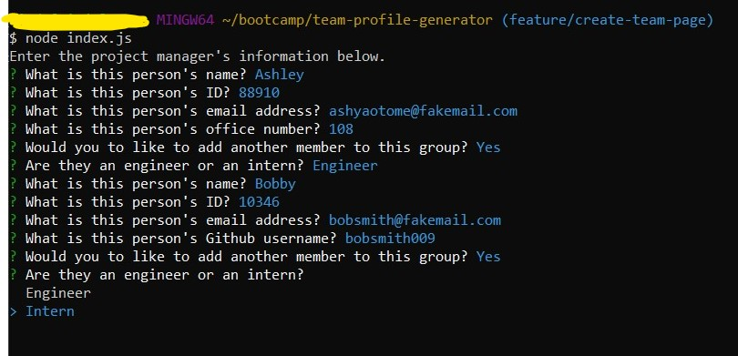

# Team Profile Generator

## Description

This is an application that creates an HTML page with cards of the people in a team. To use it, the user can run the application in their terminal and the program will ask questions about each person in the team. Once everybody has been included, the page will be generated and will create cards for everybody with information. Each card will have information such as ID number, email, and additional information depending on their role in the team. This allows an area where people can see who's in the team with easily accessible information in one place!

## Process

This program can be started up using the terminal once it's downloaded. Navigate to the project folder and download the node dependencies using ``npm i`.

Next, start up the program with ``node index.js`` and the terminal will start off with questions about the project manager. There will be questions about their name, ID, email, and office number for contact information. 

When finished, then the program will ask if the user would like to add another person to the team. If they choose yes, then the program will ask if the next person is an Engineer or an Intern. (Both prompts require arrow keys to navigate through the choices.) Engineer and intern questions are mostly the same as the manager's, aside from the last question where it asks for the engineer's GitHub username, and the intern's current school.

## Links

The link to the repository is here: https://github.com/cindyung56/team-profile-generator

A video recording of how this app works on the terminal can be viewed and downloaded here: https://drive.google.com/file/d/1IFobsnkPEDSWJ9hIzqEcHcCoGywtyhqL/view